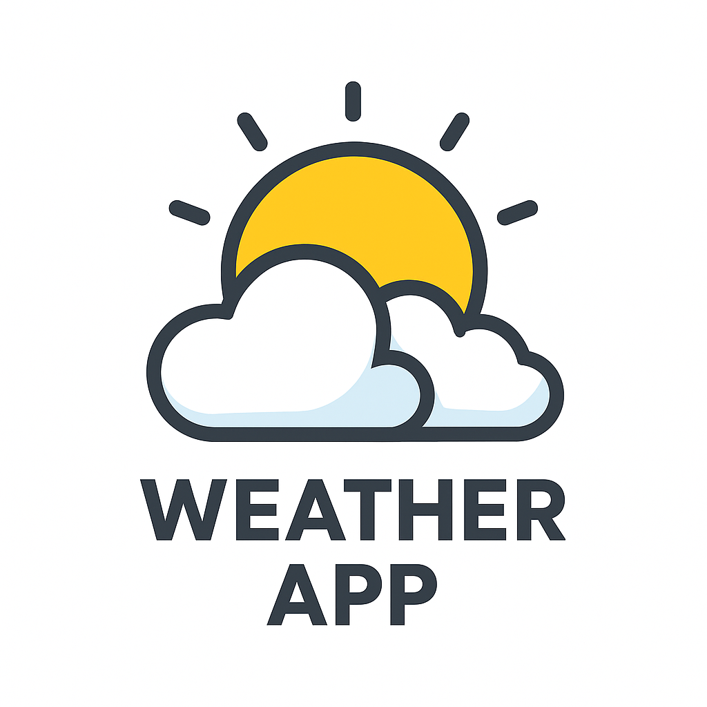

#   My Project Title


A full-stack Weather App that allows users to get real-time weather information based on their location or search input.

This project is split into two repositories:

- 🔗 [Frontend Repository](https://github.com/tomislav98/weather_app_frontend_flutter)
- 🔗 [Backend Repository](https://github.com/tomislav98/weather_app_backend_fastAPI)

---

## 📦 Repositories Overview

### 📁 Frontend

- Built with **React** / **Angular** / **Vue** (customize as needed)
- Fetches data from the backend
- Responsive UI displaying temperature, weather conditions, and more

[Go to Frontend Repo](https://github.com/your-username/weather-app-frontend)

---

### ⚙️ Backend

- Built with **Node.js + Express** / **FastAPI** / **Django** (customize)
- Fetches weather data from external APIs like OpenWeather or WeatherAPI
- Handles routes and data formatting

[Go to Backend Repo](https://github.com/your-username/weather-app-backend)

---

## 🚀 Features

- Search weather by city
- Show temperature, humidity, wind speed, etc.
- Mobile-friendly responsive design
- Real-time updates

---

## 🔧 Installation

### 1. Clone the repositories

```bash
# Clone frontend
git clone https://github.com/your-username/weather-app-frontend.git

# Clone backend
git clone https://github.com/your-username/weather-app-backend.git
